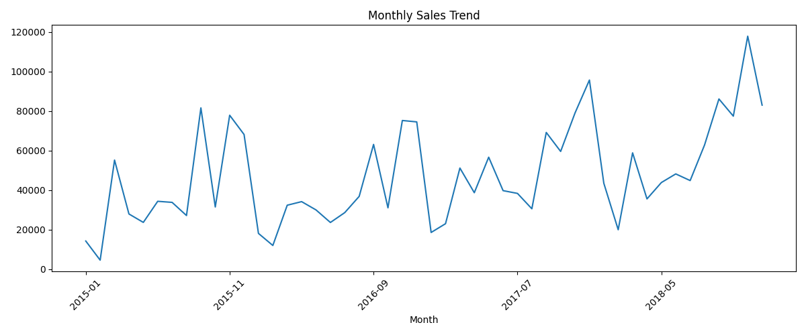
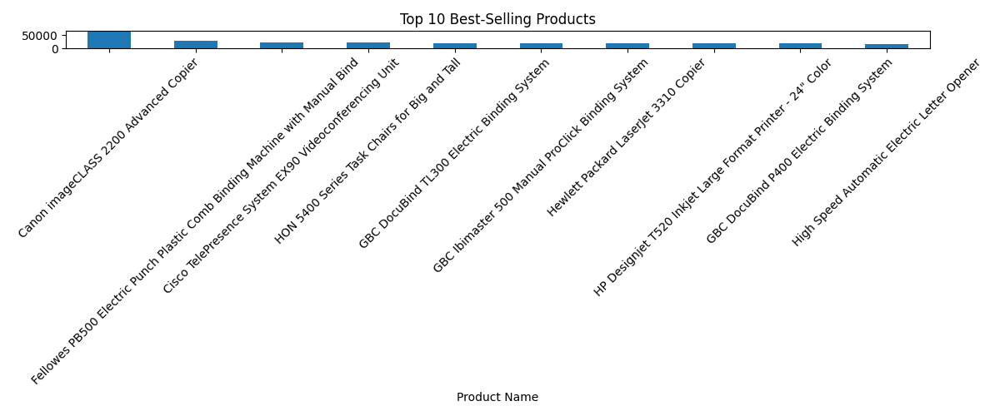
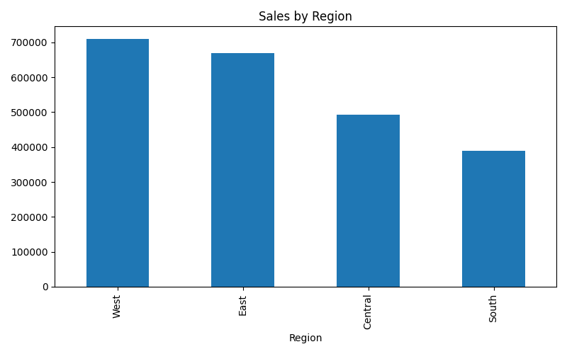
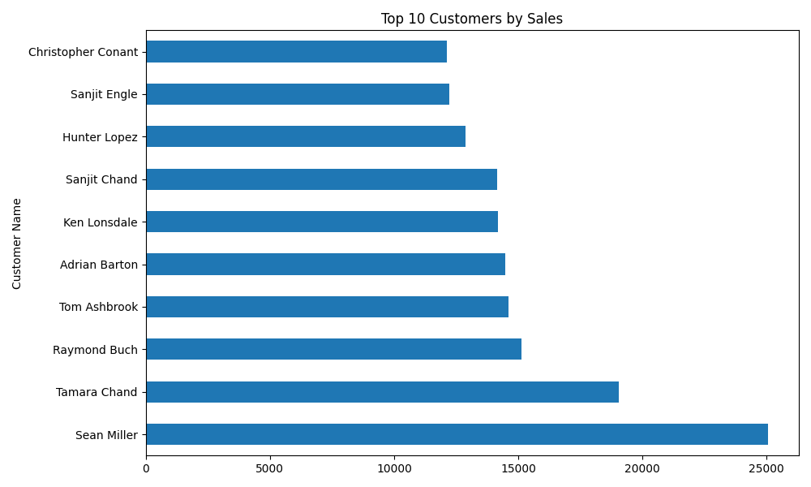
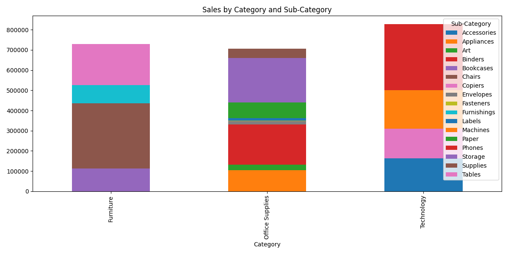
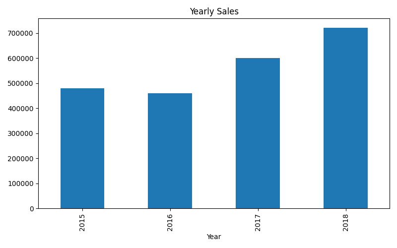

# 📊 Sales Analysis Dashboard

A Python-based data analysis project that explores sales data using `pandas` and `matplotlib` to uncover insights about monthly trends, top products, regional performance, customer behavior, and more.

---

## 🚀 Features

- 📅 Monthly and Yearly Sales Trends
- 🛍️ Top-Selling Products
- 🌍 Regional Sales Breakdown
- 🧑‍💼 Top Customers and Cities
- 📦 Category/Sub-category Sales Distribution
- 🔁 Repeat Customers
- 📈 Visualizations with Matplotlib

---

## 🗂️ Dataset

- Filename: `train.csv`
- Rows: ~9800
- Columns: 18 (e.g., `Order Date`, `Sales`, `Region`, `Product Name`, etc.)
- No missing values except `Postal Code`

---
### 📊 Output Sample









## 🛠️ Installation

1. Clone this repository  
   ```bash
   git clone https://github.com/your-username/sales_analysis_dashboard.git
   cd sales_analysis_dashboard
